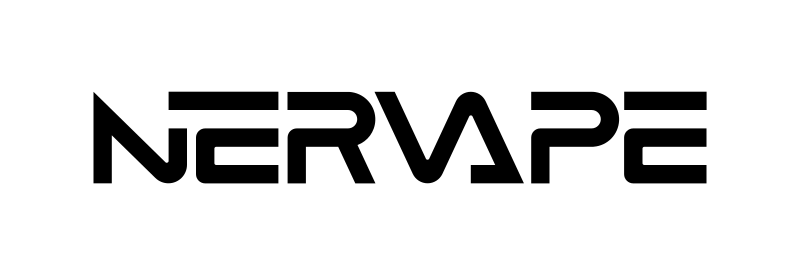
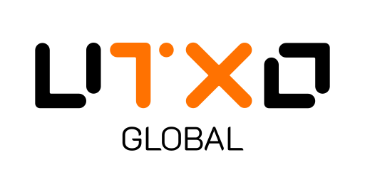

<p align="center">
  <a href="https://ckbccc-demo.vercel.app/">
    
  </a>
</p>

<h1 align="center" style="font-size: 64px;">
  CCC
</h1>

<p align="center">
  <a href="https://www.npmjs.com/package/@ckb-ccc/ccc"></a>
  
  
  
  <a href="https://ckbccc-demo.vercel.app/"></a>
</p>

<p align="center">
  "CCC - CKBers' Codebase" is the next step of "Common Chains Connector".
  <br />
  Empower yourself with CCC to discover the unlimited potential of CKB.
  <br />
  Interoperate with wallets from different chain ecosystems.
  <br />
  Fully enabling CKB's Turing completeness and cryptographic freedom power.
</p>

## Preview

<p align="center">
  <a href="https://ckbccc-demo.vercel.app/">
    
  </a>
</p>

This project is still under active development, and we are looking forward to your feedback. [Try its demo now here](https://ckbccc-demo.vercel.app/). It showcases how to use CCC for some basic scenarios in CKB.

## Transaction Composing

Here's an example for transferring CKB:

```typescript
const tx = ccc.Transaction.from({
  outputs: [{ lock: toLock, capacity: ccc.fixedPointFrom(amount) }],
});
```

Tell CCC what you need, and then...

```typescript
await tx.completeInputsByCapacity(signer);
await tx.completeFeeBy(signer, 1000); // Transaction fee rate
const txHash = await signer.sendTransaction(tx);
```

We have done everything! Check [the demo source code](./packages/demo) for complete examples.

## Installing

We design CCC for both front-end and back-end developers. You need only one package to fulfil all your needs:

- [NodeJS](https://www.npmjs.com/package/@ckb-ccc/ccc): `npm install @ckb-ccc/ccc`
- [Web Component](https://www.npmjs.com/package/@ckb-ccc/connector): `npm install @ckb-ccc/connector`
- [React](https://www.npmjs.com/package/@ckb-ccc/connector-react): `npm install @ckb-ccc/connector-react`

CCC exports everything on the `ccc` object:

```typescript
import { ccc } from "@ckb-ccc/<package-name>";
```

## FAQs

### Property '*' does not exist on type 'typeof import("\*/@ckb-ccc/connector-react/dist/barrel")'.ts(2339)

CCC uses JS's [Package Entry Points](https://nodejs.org/api/packages.html#packages_package_entry_points) feature to help tree shaking while exporting everything on the `ccc` object. Ensure in your `tsconfig.json`, `moduleResolution` is set to `node16`, `nodenext`, or `bundler`, and `resolvePackageJsonExports` is not disabled.

Read the [TypeScript's Guide](https://www.typescriptlang.org/docs/handbook/modules/reference.html#packagejson-exports) for more.

### Can I use Lumos with CCC?

While we recommend using CCC for composing transactions, we also provide Lumos patches to:

- Support the JoyID Wallet.
- Support the Nostr Wallet.

See [lumos-patches](https://www.npmjs.com/package/@ckb-ccc/lumos-patches): `npm install @ckb-ccc/lumos-patches`

You can apply patches by:

```typescript
import { generateDefaultScriptInfos } from "@ckb-ccc/lumos-patches";

// Before using Lumos. You don't need @ckb-lumos/joyid anymore.
registerCustomLockScriptInfos(generateDefaultScriptInfos());
```

## Who uses CCC?

| [](https://utxoswap.xyz/) | [](https://mobit.app/) | [](https://d.id/) | [](https://omiga.io/) |
| --------------------------------------------------------------------------------- | --------------------------------------------------------------------------- | -------------------------------------------------------------------- | -------------------------------------------------------------------------- |

| [](https://www.nervape.com/) | [](https://utxo.global/) | [](https://bool.network/) | [](https://joydao.cc/) | [](https://world3.ai/) |
| ----------------------------------------------------------------------------------- | ---------------------------------------------------------------------------------- | ------------------------------------------------------------------------------------ | ---------------------------------------------------------------------------- | ---------------------------------------------------------------------------- |

## Links

- [Nervos CKB Docs](https://docs.nervos.org/) is the documentation website of Nervos CKB.
- [Lumos](https://github.com/ckb-js/lumos) and its [Docs](https://lumos-website.vercel.app/): Lumos provides utils to help compose CKB transactions.
- [RGB++ SDK](https://github.com/ckb-cell/rgbpp-sdk) and its [Design](https://github.com/ckb-cell/RGBPlusPlus-design): RGB++ is a protocol for issuing assets with Turing-completed VM on BTC L1.
- [Spore SDK](https://github.com/sporeprotocol/spore-sdk) and its [Docs](https://docs.spore.pro/): The on-chain digital object (DOBs) protocol designed to empower ownership, distribution, and value capture.
